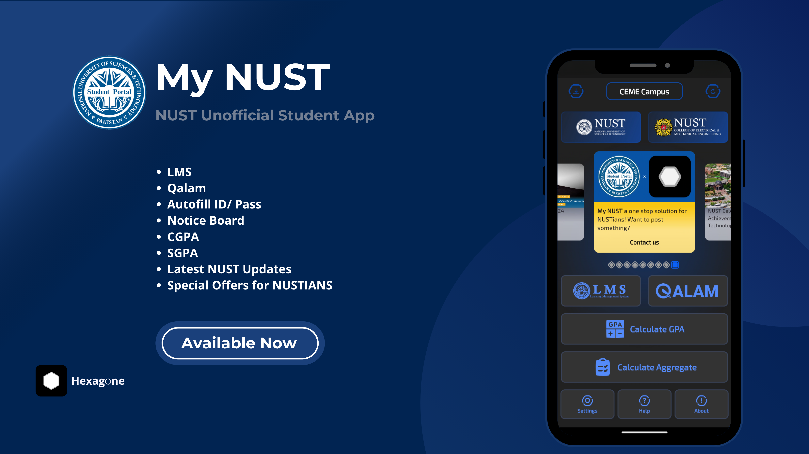
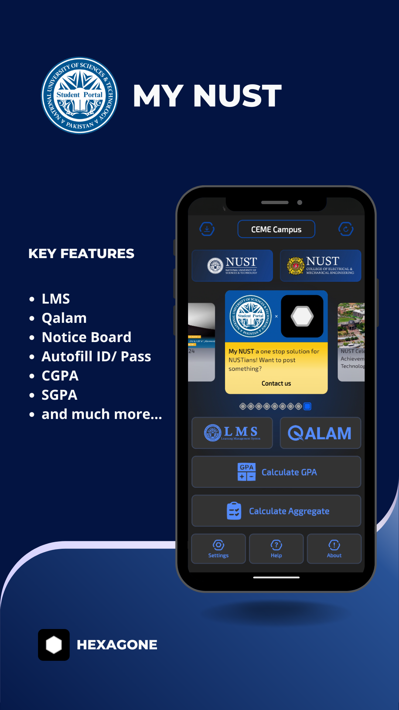
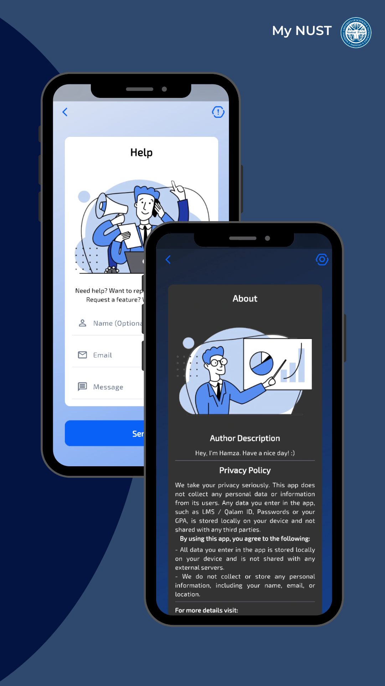
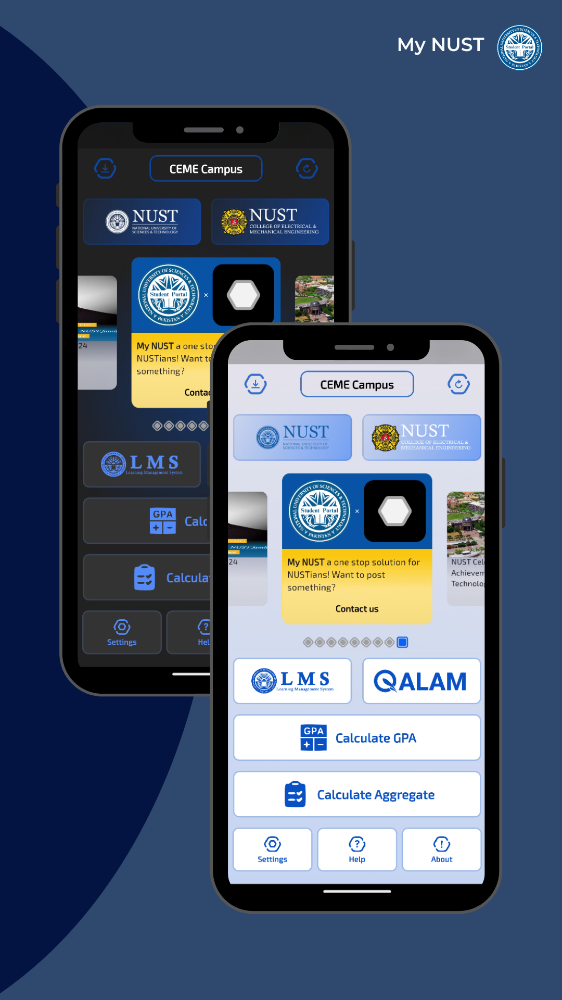
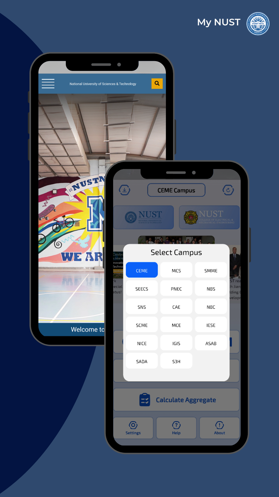
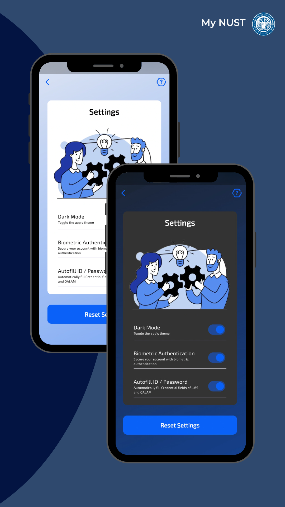
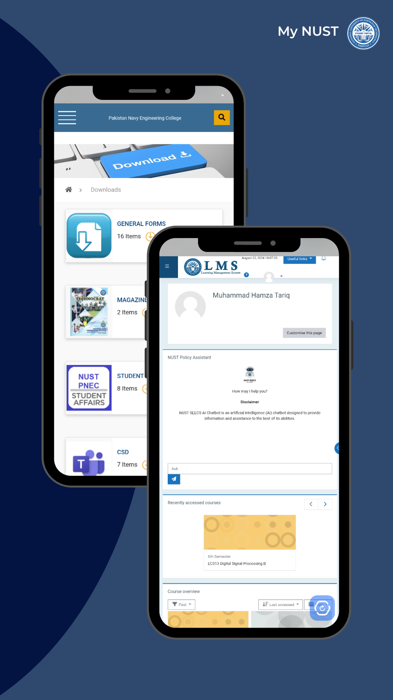

# My NUST - NUST Unofficial Student Portal



## Availability

- **Google Play Store**: [Download Now](https://play.google.com/store/apps/details?id=com.hexagone.mynust&pcampaignid=web_share) - **10,000+ Downloads**
- **Apple App Store**: Submission pending — awaiting confirmation/approval from NUST

## About

'My NUST' is your ultimate companion for a seamless university experience. Designed exclusively for NUST students, this comprehensive app brings a range of features right to your fingertips, enhancing your academic journey and campus life like never before.

This app is **open-source** and the complete codebase is public on GitHub to ensure transparency and community collaboration.

## Key Features

### Integrated Portal Access
- **NUST Qalam Integration**: Access the official Qalam portal directly within the app via WebView. View exam results, attendance records, and academic progress in real-time.
- **LMS Integration**: Access the NUST Learning Management System seamlessly. View course materials, lecture slides, assignments, and important announcements without leaving the app.
- **Secure Autofill**: Encrypted credential storage with user consent for quick and secure login to Qalam and LMS. Your credentials are stored locally and never shared.

### Smart Notice Board
- **Campus-Specific Updates**: Get notices and news tailored to your specific school/sub-campus within NUST.
- **NUST-Wide Announcements**: Stay updated with university-wide events, deadlines, and important news.
- **Featured Banners**: Custom notice board banners highlight urgent and featured announcements so you never miss critical information.
- **Real-time Sync**: Automatically fetches the latest notices from official NUST and campus websites.

### Academic Calculators
- **GPA Calculator**: Calculate both expected CGPA (Cumulative GPA) and SGPA (Semester GPA) accurately. Monitor your academic performance and plan ahead.
- **Absolutes Calculator**: Calculate your absolutes to get a better estimate of your expected grades based on your current performance.

### Push Notifications
- Receive in-app notifications for important updates, announcements, and deadlines.
- Stay informed without constantly checking the app.

## Getting Started

### Prerequisites

Before you begin, ensure you have the following installed on your system:

- **Flutter SDK** (3.0 or higher) - [Install Flutter](https://docs.flutter.dev/get-started/install)
- **Dart SDK** (comes with Flutter)
- **Android Studio** or **Xcode** (for iOS development)
- **Git** - [Install Git](https://git-scm.com/downloads)
- **Firebase Account** - Required for backend services

### Installation & Setup

1. **Clone the Repository**
   ```bash
   git clone https://github.com/Hmmza-tariq/My-NUST.git
   cd My-NUST
   ```

2. **Install Dependencies**
   ```bash
   flutter pub get
   ```

3. **Setup Environment Variables**
   - Copy the `.env.example` file to `.env`:
     ```bash
     cp .env.example .env
     ```
   - The `.env` file contains NUST portal URLs:
     - `LMS_URL` - NUST Learning Management System URL
     - `QALAM_URL` - NUST Qalam portal URL

4. **Firebase Configuration**
   - Create a new Firebase project at [Firebase Console](https://console.firebase.google.com/)
   - Add Android and iOS apps to your Firebase project
   - Download and place the configuration files:
     - `google-services.json` → `android/app/`
     - `GoogleService-Info.plist` → `ios/Runner/`
   - Run the FlutterFire CLI to configure Firebase:
     ```bash
     flutter pub global activate flutterfire_cli
     flutterfire configure
     ```

5. **Check Flutter Setup**
   ```bash
   flutter doctor
   ```
   Resolve any issues reported by the doctor command.

### Running the App

#### On Android
```bash
flutter run
```
or use Android Studio/VS Code to run the app on an emulator or connected device.

#### On iOS (macOS only)
```bash
cd ios
pod install
cd ..
flutter run
```

#### Build Release APK (Android)
```bash
flutter build apk --release
```

#### Build iOS App (macOS only)
```bash
flutter build ios --release
```

## Project Structure

```
lib/
├── app/
│   ├── controllers/      # State management controllers
│   ├── data/            # Data models and entities
│   ├── modules/         # Feature modules (Home, Auth, GPA Calculator, etc.)
│   ├── resources/       # App resources (colors, fonts, strings, themes)
│   ├── routes/          # Navigation and routing
│   └── services/        # Services (notifications, etc.)
├── firebase_options.dart # Firebase configuration
└── main.dart            # App entry point
```

## Technologies Used

- **Flutter & Dart**: Cross-platform mobile development
- **GetX**: State management and navigation
- **Firebase**: Backend services (Firestore, Cloud Messaging, Analytics)
- **WebView**: Embedded portal access for Qalam and LMS
- **Encrypted Shared Preferences**: Secure local storage for credentials

## Contributing

Contributions are welcome! Feel free to:
- Report bugs and issues
- Suggest new features
- Submit pull requests

Please read our [Contributing Guidelines](CONTRIBUTING.md) and [Code of Conduct](CODE_OF_CONDUCT.md) before contributing.

### How to Contribute

1. Fork the repository
2. Create a feature branch (`git checkout -b feature/amazing-feature`)
3. Commit your changes (`git commit -m 'feat: add amazing feature'`)
4. Push to the branch (`git push origin feature/amazing-feature`)
5. Open a Pull Request

Please ensure your code follows the existing style and includes appropriate tests.

## Privacy & Security

We take your privacy seriously. This app does not collect any personal data or information from its users. 

**Privacy Highlights:**
- All credentials (LMS/Qalam ID and passwords) are **encrypted** and stored **locally** on your device
- No personal information is shared with external servers or third parties
- GPA calculations and academic data remain on your device
- User consent is required before enabling autofill features

**Security:**
- End-to-end encryption for stored credentials
- Biometric authentication support
- Secure WebView implementation
- Regular security updates

For security concerns or to report vulnerabilities, please see our [Security Policy](SECURITY.md).

For more details, please visit:
- [Privacy Policy](https://sites.google.com/view/my-nust-privacy-policy/home)
- [Terms and Conditions](https://sites.google.com/view/my-nust-terms-and-conditions/home)

## License

This project is open source under the terms specified in the [LICENSE](LICENSE) file.

## Contact & Support

For questions, feedback, or support:
- Open an issue on [GitHub](https://github.com/Hmmza-tariq/My-NUST/issues)
- Check existing discussions and FAQs

## Support the Project

If you find this app helpful, please:
- Give it a ⭐ on GitHub
- Share it with fellow NUST students
- Leave a positive review on the Play Store
- Contribute to the codebase

## Screenshots

|   |   |
|--------------|--------------|
|  |  |
|  |  |
|  |  |

---

Made by a Nustian for Nustians
